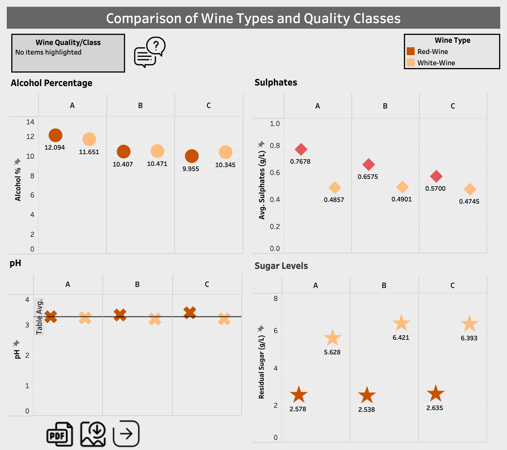

# Is it a good one or just expensive? Insights for wine enthusiasts

Recently, there has been an increase in wine consumption, and wine industries strive to produce good quality wine at the least cost. The majority of the chemicals are very similar for different types of wine. Nonetheless, the exact concentration of each chemical is different in various kinds of wines. Physicochemical and sensory tests assess wine’s quality.

I used the NumPy package to process and categorize each physiochemical feature of both wine and red wines. Via the Pandas package, I created several tables. 

In Tableau Desktop, I created interactive graphs and dashboards to illustrate differences in physiochemical features between red and white wine qualities.
These dashboards provide a comparison between white and red wine but also among qualities in each wine category. 

## Tools
Python's NumPy and Pandas Libraries

Tableau Desktop
## Insights

Alcohol Percentage

1- Red wine contains slightly more alcohol than white wine.
2- Red Wine A quality also has more alcohol per volume.

Sulphates

1- In all quality classes, red wine has more sulphate concentration.
2- In white wine, the sulphate amount does not differ among its quality groups.
3- For red wine, the sulphate amount lowers as quality declines. 

pH

1- It is the most stable physiochemical feature in comparison between wine types and among qualities.

Sugar Levels

1- Red wine contains significantly lower sugar in each quality group than white wine.
2- A-grade wine has the lowest sugar amount compared to its lower qualities for white wine.

Free SO2

1- The lowest quality white wine contains the highest average free SO2.

Fixed Acidity

2-Fixed acidity remains stable for all quality classes of red and white wine (comparison done within each wine type). 

Volatile Acidity

3- For red wine, as volatile acidity increases, quality decreases.
4- This volatile acidity correlation *is not valid* for white wine.

Citric Acid Addition

1- White wine, independent of its quality, has citric acid addition.
2- In contrast, red wine tends to have no citric acid addition as quality decreases.

Chlorides/Salty Taste
1- For every quality grade, white wine tastes more salty than red wine.
2- The salty taste of red and white wine became prominent as quality decreased.

## Dashboard Images 

## Background to Dataset

The eleven physicochemical properties are: fixed acidity, volatile acidity, citric acid, residual sugar, chlorides, free sulfur dioxide, total sulfur dioxide, density, pH, sulphates, and alcohol (Cortez et al., 2009).

Citric acid is often added to wines to increase acidity, complement a specific flavor or prevent ferric hazes. It can be added to finished wines to increase acidity and give a “fresh" flavor. The disadvantage of adding citric acid is its microbial instability. Since bacteria use citric acid in their metabolism, it may increase the growth of unwanted microbes (Zhong et al., 2020).
Residual Sugar is from natural grape sugars leftover in a wine after the alcoholic fermentation finishes. 

Residual sugar levels vary in different types of wine. In fact, many grocery store wines labeled as “dry" contain about 10 g/L of residual sugar. Noticeably sweet wines start at around 35 grams per liter of residual sugar and then go up from there (Wang & Peng, 2017).

Volatile acidity is a measure of the low molecular weight (or steam distillable) fatty acids in wine and is generally perceived as the odour of vinegar. Winemakers are usually most concerned with acetic acid, which accounts for more than 93% of steam distillable acids in wine. The average volatile acidity value for red table wines during this period is about 0.60 g/L. The average volatile acidity value for white table wines is about 0.43 g/L (Vilela, 2018).

## Legend

fixed acidity (g(tartaric acid)/L), volatile acidity (g(acetic acid)/L), citric acid(g/L), residual sugar (g/L), chlorides(g(sodium chloride)/L), free sulfur dioxide (mg/L), total sulfur dioxide (mg/L), density (g/ml), pH , sulphates(g(potassium sulphate)/L), alcohol ( % vol.)
## Acknowledgements

 - Original Source DOI: 10.24432/C56S3T
 Modeling wine preferences by data mining from physicochemical properties
By P. Cortez, A. Cerdeira, Fernando Almeida, Telmo Matos, J. Reis. 2009

- This dataset is licensed under a Creative Commons Attribution 4.0 International (CC BY 4.0) license.
